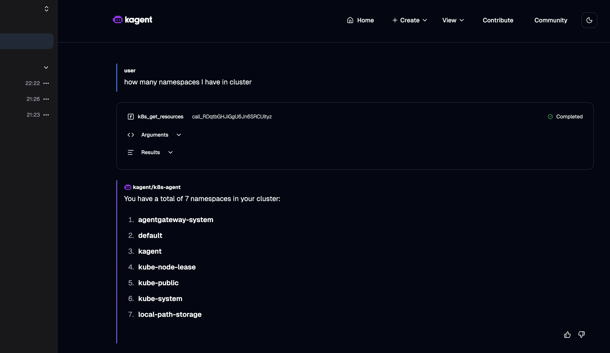

Setup:

```
kagent
   │
   ▼
AgentGateway
   │
   ▼
OpenAI
```


Install CRDs:

```bash
helm upgrade -i --create-namespace \
  --namespace agentgateway-system \
  agentgateway-crds \
  oci://cr.agentgateway.dev/charts/agentgateway-crds
```

Install gateway:
```bash
helm upgrade -i \
  --namespace agentgateway-system \
  agentgateway \
  oci://cr.agentgateway.dev/charts/agentgateway
```

Gateway config:
```yaml
apiVersion: gateway.networking.k8s.io/v1
kind: Gateway
metadata:
  name: agentgateway-proxy
  namespace: agentgateway-system
spec:
  gatewayClassName: agentgateway
  listeners:
    - protocol: HTTP
      port: 80
      name: http
      allowedRoutes:
        namespaces:
          from: All
```

openai-secret:
```yaml
apiVersion: v1
kind: Secret
metadata:
  name: openai-secret
  namespace: agentgateway-system
type: Opaque
stringData:
  Authorization: MY_OPENAI_API_KEY
```
openai-backend:

```yaml
apiVersion: agentgateway.dev/v1alpha1
kind: AgentgatewayBackend
metadata:
  name: openai
  namespace: agentgateway-system
spec:
  ai:
    provider:
      openai:
        model: gpt-4o-mini
  policies:
    auth:
      secretRef:
        name: openai-secret
```

openai-route:
```yaml
apiVersion: gateway.networking.k8s.io/v1
kind: HTTPRoute
metadata:
  name: openai
  namespace: agentgateway-system
spec:
  parentRefs:
    - name: agentgateway-proxy
      namespace: agentgateway-system
  rules:
    - backendRefs:
        - name: openai
          namespace: agentgateway-system
          group: agentgateway.dev
          kind: AgentgatewayBackend
```

Check if gateway is working (without running agents):

```bash
kubectl port-forward -n agentgateway-system svc/agentgateway-proxy 8080:80
```
```bash
curl -s http://localhost:8080/v1/chat/completions \
  -H "Content-Type: application/json" \
  -d '{
    "model": "",
    "messages": [
      {"role": "user", "content": "Reply with: GO GO GO"}
    ]
  }'
```
fetch gateway logs to see if traffic actually goes through gw
```bash
kubectl logs -n agentgateway-system deployment/agentgateway-proxy -f
```
Create dummy openai secret in the kagent workspace. It's kind of workaround since I didn't find a way to disable auth on kagent. Without this secret agent (not kagent) is failing.
```bash
kubectl create namespace kagent
kubectl create secret generic kagent-openai -n kagent --from-literal=OPENAI_API_KEY=dummy
```
create values file for further kagent helm deployment. Here we also enable one agent (k8s-agent) for testing

```bash
cat > kagent-values-minimal.yaml <<'EOF'
kmcp:
  enabled: false
kagent-tools:
  enabled: true
tools:
  grafana-mcp:
    enabled: false
  querydoc:
    enabled: false
agents:
  argo-rollouts-agent:
    enabled: false
  cilium-debug-agent:
    enabled: false
  cilium-manager-agent:
    enabled: false
  cilium-policy-agent:
    enabled: false
  helm-agent:
    enabled: false
  istio-agent:
    enabled: false
  k8s-agent:
    enabled: true
  kgateway-agent:
    enabled: false
  observability-agent:
    enabled: false
  promql-agent:
    enabled: false
EOF
```

install kagent
```bash
helm install kagent-crds oci://ghcr.io/kagent-dev/kagent/helm/kagent-crds \
  --namespace kagent \
  --create-namespace \
  --version 0.7.23

helm install kagent oci://ghcr.io/kagent-dev/kagent/helm/kagent \
  --namespace kagent \
  --version 0.7.23 \
  -f kagent-values-minimal.yaml
```

Forward kagent traffic to gateway. In secret section I put dummy values created previously.

```yaml
apiVersion: kagent.dev/v1alpha2
kind: ModelConfig
metadata:
  name: default-model-config
  namespace: kagent
spec:
  apiKeySecret: kagent-openai
  apiKeySecretKey: OPENAI_API_KEY
  model: some-model
  provider: OpenAI
  openAI:
    baseUrl: "http://agentgateway-proxy.agentgateway-system.svc.cluster.local/v1"
```

Final test

```bash
kagent dashboard
```
Ask something:




Confirm that traffic is routed through the gateway by checking the logs
```bash
kubectl logs -n agentgateway-system deployment/agentgateway-proxy -f


2026-03-14T20:35:42.543107Z	info	request gateway=agentgateway-system/agentgateway-proxy listener=http route=agentgateway-system/openai endpoint=api.openai.com:443 src.addr=10.244.1.10:56950 http.method=POST http.host=agentgateway-proxy.agentgateway-system.svc.cluster.local http.path=/v1/chat/completions http.version=HTTP/1.1 http.status=200 protocol=llm gen_ai.operation.name=chat gen_ai.provider.name=openai gen_ai.request.model=gpt-4o-mini gen_ai.response.model=gpt-4o-mini-2024-07-18 gen_ai.usage.input_tokens=3125 gen_ai.usage.output_tokens=18 duration=1934ms
2026-03-14T20:35:44.783616Z	info	request gateway=agentgateway-system/agentgateway-proxy listener=http route=agentgateway-system/openai endpoint=api.openai.com:443 src.addr=10.244.1.10:56950 http.method=POST http.host=agentgateway-proxy.agentgateway-system.svc.cluster.local http.path=/v1/chat/completions http.version=HTTP/1.1 http.status=200 protocol=llm gen_ai.operation.name=chat gen_ai.provider.name=openai gen_ai.request.model=gpt-4o-mini gen_ai.response.model=gpt-4o-mini-2024-07-18 gen_ai.usage.input_tokens=3239 gen_ai.usage.output_tokens=61 duration=2062ms
```


